# AtliQ Mart - Festive Promotions Analysis

AtliQ Mart is a leading retail chain with over 50 supermarkets across South India. During the festive seasons of Diwali 2023 and Sankranti 2024, all stores launched large-scale promotional campaigns exclusively on AtliQ-branded products.

The objective of these campaigns was to drive higher sales volumes and revenue during peak festive demand. the Sales Director, required immediate insights to understand which promotions performed well and which did not, enabling data-driven decisions for future promotional planning.

This project evaluates the performance of promotional strategies by analyzing sales data across campaigns, stores, products, and promotion types. The study focuses on key metrics such as Incremental Revenue (IR), Incremental Sold Units (ISU), and promotion effectiveness to identify patterns, strengths, and gaps.

---

## Key Insights :

### Store Performance Analysis :
Bengaluru emerged as the top-performing city with the highest incremental revenue.  
Chennai & Mysuru consistently ranked among the top stores.  
Cities like Vijayawada & Trivandrum underperformed indicating execution gaps.  

---

### Promotion Type Analysis :
BOGOF (Buy One Get One Free) drove the highest growth in sold units.  
500 Cashback delivered the strongest incremental revenue.  
Flat discounts (25%, 33%, 50% OFF) showed negative revenue impact - even when units increased.  

---

### Product & Category Analysis :
Combo packs generated the highest incremental revenue.  
Grocery & Staples led in incremental sold units, especially during Sankranti.  
Personal Care underperformed across both campaigns.  

---

## Recommendations :
Prioritize Bengaluru, Chennai, and Mysuru for premium & experimental promotions.  
Scale 500 Cashback for high-value & bundled products.  
Use BOGOF selectively for volume-driven categories & inventory clearance.  
Reduce dependency on flat percentage discounts.  
Rework product mix & promotion strategy in low-performing cities.  
Focus festive campaigns on combo packs, grocery & utility products.  

---

# SQL Queries

## Sales Summary View

  ```sql
   CREATE VIEW `sales_summary` AS
SELECT 
    c.campaign_name AS campaign_name,
    s.city AS city,
    p.product_name AS product_name,
    p.category AS category,
    fe.promo_type AS promo_type,
    SUM(fe.`quantity_sold_before_promo`) AS quantity_sold_before_promo,
    SUM(
        CASE 
            WHEN fe.promo_type = 'BOGOF'
                THEN fe.`quantity_sold_after_promo` * 2
            ELSE fe.`quantity_sold_after_promo`
        END
    ) AS quantity_sold_after_promo,

    SUM(fe.`quantity_sold_before_promo` * fe.base_price) 
        AS revenue_before_promo,
    SUM(
        CASE
            WHEN fe.promo_type = 'BOGOF'
                THEN fe.base_price * 0.5 * (fe.`quantity_sold_after_promo` * 2)
            WHEN fe.promo_type = '500 Cashback'
                THEN (fe.base_price - 500) * fe.`quantity_sold_after_promo`
            WHEN fe.promo_type = '50% OFF'
                THEN fe.base_price * 0.5 * fe.`quantity_sold_after_promo`
            WHEN fe.promo_type = '33% OFF'
                THEN fe.base_price * 0.67 * fe.`quantity_sold_after_promo`
            WHEN fe.promo_type = '25% OFF'
                THEN fe.base_price * 0.75 * fe.`quantity_sold_after_promo`
            ELSE 0
        END
    ) AS revenue_after_promo,
    (
        SUM(
            CASE 
                WHEN fe.promo_type = 'BOGOF'
                    THEN fe.`quantity_sold_after_promo` * 2
                ELSE fe.`quantity_sold_after_promo`
            END
        )
        - SUM(fe.`quantity_sold_before_promo`)
    ) AS ISU,
    (
        SUM(
            CASE
                WHEN fe.promo_type = 'BOGOF'
                    THEN fe.base_price * 0.5 * (fe.`quantity_sold_after_promo` * 2)
                WHEN fe.promo_type = '500 Cashback'
                    THEN (fe.base_price - 500) * fe.`quantity_sold_after_promo`
                WHEN fe.promo_type = '50% OFF'
                    THEN fe.base_price * 0.5 * fe.`quantity_sold_after_promo`
                WHEN fe.promo_type = '33% OFF'
                    THEN fe.base_price * 0.67 * fe.`quantity_sold_after_promo`
                WHEN fe.promo_type = '25% OFF'
                    THEN fe.base_price * 0.75 * fe.`quantity_sold_after_promo`
                ELSE 0
            END
        )
        - SUM(fe.`quantity_sold_before_promo` * fe.base_price)
    ) AS IR

FROM fact_events fe
JOIN dim_stores s 
    ON fe.store_id = s.store_id
JOIN dim_campaigns c 
    ON fe.campaign_id = c.campaign_id
JOIN dim_products p 
    ON fe.product_code = p.product_code

GROUP BY
    c.campaign_name,
    s.city,
    p.product_name,
    p.category,
    fe.promo_type;
```

1) High-Value BOGOF Products: Provide a list of products with a base price greater than 500 and that are featured in promo type of 'BOGOF' (Buy One Get One Free). This information will help us identify high-value products that are currently being heavily discounted, which can be useful for evaluating our pricing and promotion strategies.

   ```sql
   SELECT
     DISTINCT p.product_name,
     e.base_price
   FROM fact_events e
   JOIN dim_products p
   ON e.product_code = p.product_code
   WHERE e.base_price > 500 AND e.promo_type = "BOGOF";
   ```
   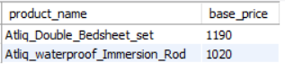
   
---

2) Store Presence by City: Generate a report that provides an overview of the number of stores in each city.

   ```sql
   SELECT city,COUNT(store_id) as total_stores
   FROM dim_stores
   GROUP BY city 
   ORDER BY total_stores DESC;
   ```
   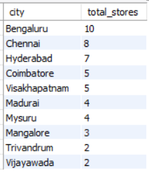

---

3) Generate a report that displays each campaign along with the total revenue generated before and after the campaign. The report includes three key fields: campaign_name, total_revenue(before_promotion) and total_revenue(after_promotion).

   ```sql
   SELECT
    campaign_name,
    CONCAT(ROUND(SUM(revenue_before_promo) / 1000000, 2),'M') AS revenue_before_million,
    CONCAT(ROUND(SUM(revenue_after_promo) / 1000000, 2),'M') AS revenue_after_million,
    CONCAT(ROUND(SUM(IR)/1000000,2),'M') AS IR,
    ROUND((SUM(IR)) / NULLIF(SUM(revenue_before_promo), 0) * 100,2) AS `IR%`
   FROM sales_summary
   GROUP BY campaign_name;
   ```
   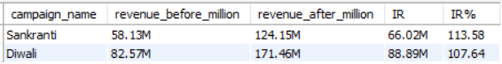

---

4) Diwali & Sankranti Campaign ISU% Analysis.

   ```sql
   --- For Diwali Campaign
   SELECT
    category,
    quantity_before_promo,
    quantity_after_promo,
    `ISU%`,
    RANK() OVER (ORDER BY `ISU%` DESC) AS Ranking
   FROM
    (
        SELECT
            category,
            SUM(quantity_sold_before_promo) AS quantity_before_promo,
            SUM(quantity_sold_after_promo) AS quantity_after_promo,
            ROUND((SUM(ISU)) / NULLIF(SUM(quantity_sold_before_promo), 0) * 100,2) AS `ISU%`
        FROM sales_summary
        WHERE campaign_name = 'Diwali'
        GROUP BY category
    ) AS subquery;
   ```
   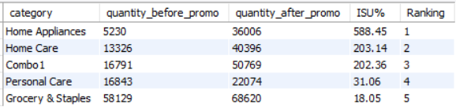

    ```sql
   --- For Sankranti Campaign
   SELECT
    category,
    quantity_before_promo,
    quantity_after_promo,
    `ISU%`,
    RANK() OVER (ORDER BY `ISU%` DESC) AS Ranking
   FROM
    (
        SELECT
            category,
            SUM(quantity_sold_before_promo) AS quantity_before_promo,
            SUM(quantity_sold_after_promo) AS quantity_after_promo,
            ROUND((SUM(ISU)) / NULLIF(SUM(quantity_sold_before_promo), 0) * 100,2) AS `ISU%`
        FROM sales_summary
        WHERE campaign_name = 'Sankranti'
        GROUP BY category
    ) AS subquery;
   ```
    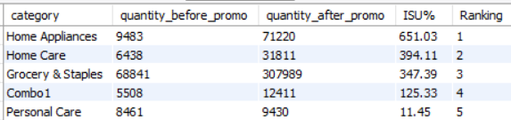
   
---

5) Create a report featuring the Top 5 products, ranked by Incremental Revenue Percentage (IR%), across all campaigns.

   ```sql
   SELECT
    product_name,
    category,
    ROUND (SUM(IR) / SUM(revenue_before_promo) * 100,2) AS `IR%`,
    RANK() OVER (ORDER BY SUM(IR) / SUM(revenue_before_promo) * 100 DESC) AS ranking
   FROM sales_summary
   GROUP BY product_name, category
   ORDER BY `IR%` DESC
   LIMIT 5;
   ```
   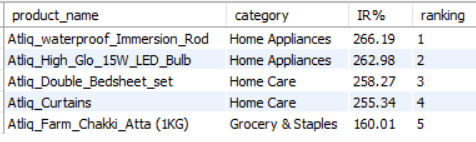

---

6) Which cities generated the highest Incremental Revenue (IR) during promotional campaigns?

   ```sql
   SELECT
    city,
    CONCAT(ROUND(SUM(revenue_before_promo) / 1000000, 2), 'M') AS revenue_before_promo,
    CONCAT(ROUND(SUM(revenue_after_promo) / 1000000, 2), 'M') AS revenue_after_promo,
    CONCAT(ROUND(SUM(IR) / 1000000, 2), 'M')  AS incremental_revenue,
    RANK() OVER (ORDER BY SUM(IR) DESC) AS city_rank
   FROM sales_summary
   GROUP BY city
   ORDER BY SUM(IR) DESC;
   ```
   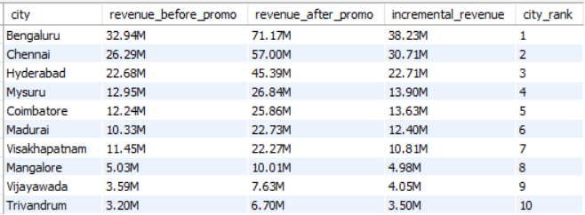
   
---

7) Top 10 store based on incremental revenue.

   ```sql
   SELECT 
    s.store_id,
    s.city,
    ROUND(
       SUM(
            (f.base_price * f.quantity_sold_after_promo)
            -
            (f.base_price * f.quantity_sold_before_promo)
        ) / 1000000,
        2
    ) AS incremental_revenue_mln
   FROM fact_events f
   INNER JOIN dim_stores s
    ON f.store_id = s.store_id
   GROUP BY s.store_id, s.city
   ORDER BY incremental_revenue_mln DESC
   LIMIT 10;
   ```
   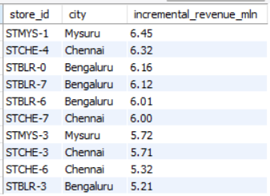

---

8) Bottom 10 store based on incremental sold units.

   ```sql
   -- Bottom 10 store based on incremental sold units
   SELECT 
       s.store_id, 
       s.city,
       SUM(
           f.quantity_sold_after_promo
           -
           quantity_sold_before_promo
           ) AS incremental_sold_quantity
   FROM fact_events f 
   JOIN dim_stores s
     ON f.store_id = s.store_id
   GROUP BY s.store_id, s.city
   ORDER BY incremental_sold_quantity
   LIMIT 10;
   ```
   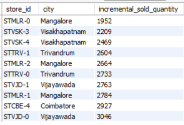

---

9) Promotion typs and its incremental sold units.

   ```sql
   SELECT
    promo_type,
    SUM(quantity_sold_before_promo) AS quantity_before_promo,
    SUM(quantity_sold_after_promo) AS quantity_after_promo,
    SUM(ISU) as incremental_sold_units,
    ROUND((SUM(quantity_sold_after_promo) - SUM(quantity_sold_before_promo))/ NULLIF(SUM(quantity_sold_before_promo), 0) * 100,2) AS `ISU%`
   FROM sales_summary
   GROUP BY promo_type
   ORDER BY `ISU%` DESC
   ```
   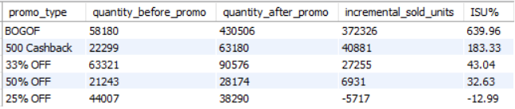

---

10) Promotion types and its incremental revenue.

   ```sql
   SELECT
    promo_type,
    CONCAT(ROUND(SUM(revenue_before_promo)/1000000,2),' M') AS revenue_before_promo,
    CONCAT(ROUND(SUM(revenue_after_promo)/1000000,2),' M') AS revenue_after_promo,
    CONCAT(ROUND(SUM(IR)/1000000,2),' M') AS incremental_revenue,
    ROUND((SUM(revenue_after_promo) - SUM(revenue_before_promo))/ NULLIF(SUM(revenue_before_promo), 0) * 100,2) AS `IR%`
    FROM
    sales_summary
   GROUP BY
    promo_type
    ORDER BY `IR%` DESC
   ```
   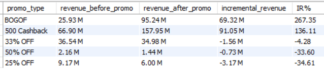

---

11) Promotion types with its incremental revenue, incremental sold units.

   ```sql
   SELECT
    promo_type,
    ROUND(SUM(IR)/1000000,2) AS IR,
    SUM(ISU) AS ISU
    FROM sales_summary
   GROUP BY promo_type
   ORDER BY IR DESC,ISU DESC
   ```
   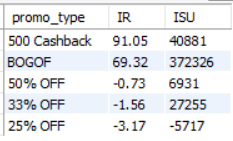

---

12) Product category and its incremental revenue.

   ```sql
   SELECT
    category,
	CONCAT(ROUND(SUM(revenue_before_promo) / 1000000, 2),'M') AS revenue_before_promo,
    CONCAT(ROUND(SUM(revenue_after_promo) / 1000000, 2),'M') AS revenue_after_promo,
    CONCAT(ROUND(SUM(IR) / 1000000, 2),'M') AS incremental_revenue,
    ROUND((SUM(IR) / SUM(revenue_before_promo)) * 100,2) AS `IR%`
   FROM sales_summary
   GROUP BY category
   ORDER BY incremental_revenue DESC;
   ```
   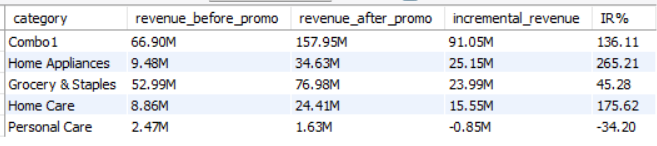

---

13) Product category - incremental sold units.

   ```sql
   SELECT
    category,
	SUM(quantity_sold_before_promo) AS quantity_sold_before_promo,
    SUM(quantity_sold_after_promo) AS revenue_after_promo,
    SUM(ISU) AS incremental_sold_units,
    ROUND((SUM(ISU) / SUM(quantity_sold_before_promo)) * 100,2) AS `ISU%`
   FROM sales_summary
   GROUP BY category
   ORDER BY incremental_sold_units DESC;
   ```
   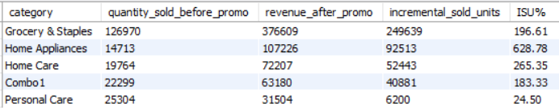

---

14) Top 3 & bottom 3 product based on incremental revenue.

   ```sql
   WITH product_revenue AS (
    SELECT
        product_name,
        category,
        CONCAT(ROUND(SUM(IR)/1000000,2),'M') AS IR,
        DENSE_RANK() OVER(ORDER BY SUM(IR) DESC) as top_rank,
        DENSE_RANK() OVER(ORDER BY SUM(IR) ASC) as bottom_rank 
    FROM sales_summary 
    GROUP BY product_name, category
    )
   SELECT 
    product_name, 
    category, 
    IR
   FROM product_revenue
   WHERE top_rank <= 3 OR bottom_rank <= 3
   ORDER BY IR DESC;
   ```
   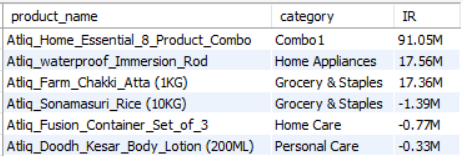

---

15) Top 3 & bottom 3 products based on incremental sold units.

   ```sql
   WITH product_revenue AS (
    SELECT
        product_name,
        category,
        SUM(ISU) AS ISU,
        DENSE_RANK() OVER(ORDER BY SUM(ISU) DESC) as top_rank,
        DENSE_RANK() OVER(ORDER BY SUM(ISU) ASC) as bottom_rank 
    FROM sales_summary 
    GROUP BY product_name, category
    )
   SELECT 
    product_name, 
    category, 
    ISU
   FROM product_revenue
   WHERE top_rank <= 3 OR bottom_rank <= 3
   ORDER BY ISU DESC;
   ```
   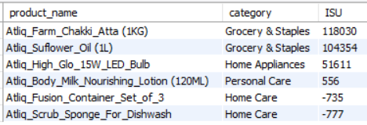

---

16) Each campaign high performing stores.

   ```sql
    WITH store_campaign_performance AS (
    SELECT 
        c.campaign_name,
        s.store_id,
        s.city,
        ROUND(
            SUM(
                (f.base_price * f.quantity_sold_after_promo)
                -
                (f.base_price * f.quantity_sold_before_promo)
            ) / 1000000,
            2
        ) AS incremental_revenue_mln
    FROM fact_events f
    INNER JOIN dim_campaigns c
        ON f.campaign_id = c.campaign_id
    INNER JOIN dim_stores s
        ON f.store_id = s.store_id
    GROUP BY 
        c.campaign_name,
        s.store_id,
        s.city
    )
    SELECT *
    FROM (
    SELECT *,
        RANK() OVER (
            PARTITION BY campaign_name
            ORDER BY incremental_revenue_mln DESC
        ) AS store_rank
    FROM store_campaign_performance
    ) ranked_stores
    WHERE store_rank <= 3;
   ```
   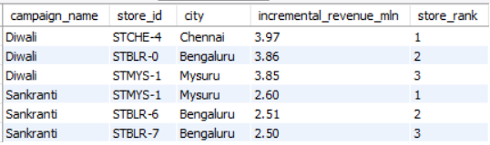

---

17) Campaign-wise Product Performance.

   ```sql
   WITH campaign_product_performance AS (
    SELECT 
        c.campaign_name,
        p.product_name,
        p.category,
        ROUND(
            SUM(
                (f.base_price * f.quantity_sold_after_promo)
                -
                (f.base_price * f.quantity_sold_before_promo)
            ) / 1000000,
            2
        ) AS incremental_revenue_mln
    FROM fact_events f
    INNER JOIN dim_campaigns c
        ON f.campaign_id = c.campaign_id
    INNER JOIN dim_products p
        ON f.product_code = p.product_code
    GROUP BY 
        c.campaign_name,
        p.product_name,
        p.category
      )
    SELECT *
    FROM (
    SELECT *,
        RANK() OVER (
            PARTITION BY campaign_name
            ORDER BY incremental_revenue_mln DESC
        ) AS product_rank
    FROM campaign_product_performance
    ) ranked_products
    WHERE product_rank <= 5;
   ```
   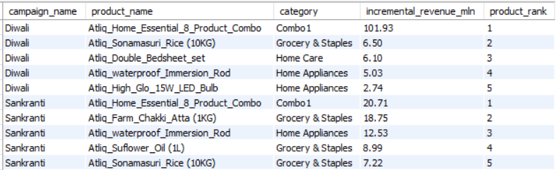

---

